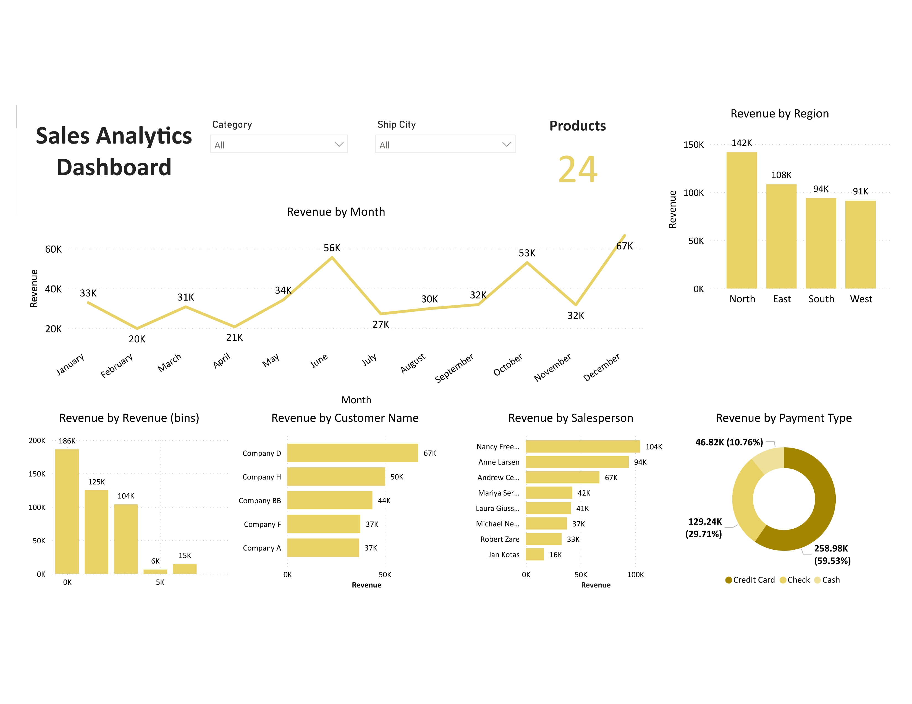

# 📊 Sales Analytics Dashboard

**Personal Power BI Project | Sales Insights & Business Intelligence**

This project presents an interactive and insightful **Sales Analytics Dashboard** developed using **Power BI**. It was designed as a personal initiative to demonstrate skills in data analysis, visualization, and business intelligence by turning raw sales data into actionable insights.

---

## 📌 Project Objective

To create a comprehensive sales reporting dashboard that:
- Tracks key sales KPIs (revenue, profit, YoY growth)
- Identifies trends, patterns, and high-performing areas
- Enables business users to make data-driven decisions

---

## 🚀 Features

- 📈 **Sales Performance Overview**  
  Visualizes total revenue, profit, and profit margin across different time periods.

- 🌍 **Geographical Analysis**  
  Regional-level sales performance via interactive maps.

- 🛒 **Top Products & Customers**  
  Ranked views to highlight best-selling items and most valuable customers.

- 📆 **Trend & Time Series Analysis**  
  Monthly and quarterly sales trends with growth comparisons.

- 🔍 **Dynamic Filtering**  
  Slicers for region, category, sales rep, and time periods for granular insights.

---

## 🔧 Tools & Technologies

- **Power BI Desktop**
- **Power Query Editor** for data transformation
- **DAX (Data Analysis Expressions)** for KPIs and calculated metrics
- **Relational Data Modeling** with star schema design

---

## 📂 Data Handling

- Imported and cleaned raw sales data using Power Query
- Created measures like:
  - `Total Sales`
  - `Total Profit`
  - `Profit %`
  - `YoY Growth`
  - `Cumulative Sales`
- Built relationships between fact and dimension tables to enable responsive filtering and analysis

---

## 📊 Sample Visuals
 
> Example:
> 

---

## 🎯 Business Impact

This dashboard simulates how a sales team or business leadership could:
- Monitor real-time performance
- Optimize product and regional strategy
- Identify areas of underperformance or growth potential

---

## 💡 Learnings

- Practiced advanced DAX for time-intelligence calculations
- Gained hands-on experience in designing visually appealing and intuitive dashboards
- Strengthened skills in data modeling and business-oriented storytelling

---

## 🧠 Future Improvements

- Integrate RLS (Row-Level Security) for user-specific data access
- Connect to a live SQL database for real-time refresh
- Add forecasting and What-If analysis for scenario planning

---

## 📁 Project File

- `Sales Analytics Dashboard.pbix` — Main Power BI report file  
*(This file is available in the repository for educational/demo purposes)*

